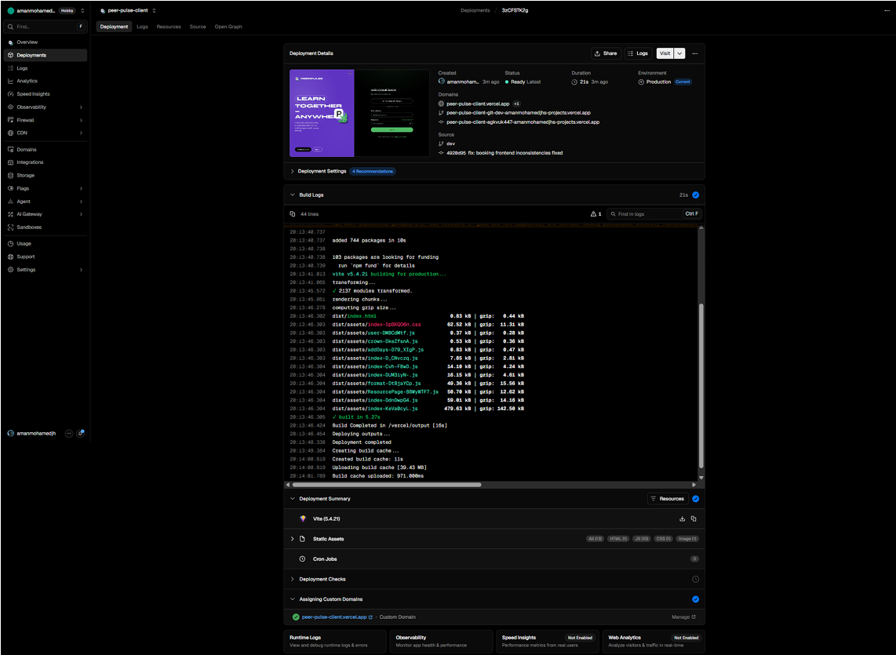
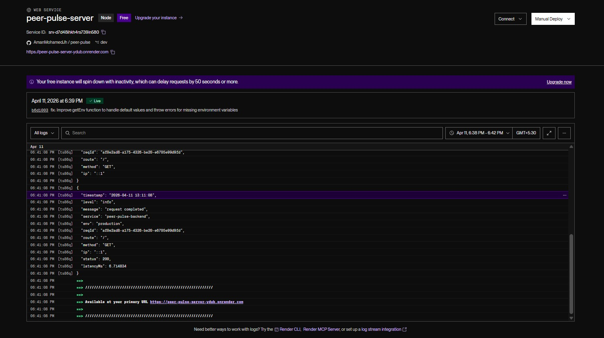

---

# Peer-Pulse

## Overview
Peer-Pulse is a comprehensive peer tutoring platform that connects students with tutors. The platform facilitates booking, managing session availability, Google Calendar integration, collaborative discussions (Study-Hub), and sharing educational resources (Knowledge Vault). Designed as a monolithic workspace, it features a React + Vite client and an Express + Node.js server.

---

## Setup Instructions
### 1. Prerequisites
- **Node.js**: v18.0.0+
- **npm**: v9.0.0+
- **MongoDB**: Local or Atlas instance

### 2. Clone the repository
```bash
git clone https://github.com/thisuriee/peer-pulse
cd peer-pulse
```

### 3. Install dependencies
```bash
npm run install:all
```

### 4. Environment configuration
Create `.env` files in both the `server` and `client` directories.

**server/.env**
- `PORT` - Server port (e.g., 8000)
- `MONGODB_URI` - MongoDB connection string (e.g., mongodb://localhost:27017/peer-pulse)
- `JWT_SECRET` - Secret key to sign JWTs (e.g., supersecret)
- `JWT_REFRESH_SECRET` - Secret key to sign Refresh JWTs
- `GOOGLE_CLIENT_ID` - Google OAuth2 client ID
- `GOOGLE_CLIENT_SECRET` - Google OAuth2 client secret
- `CLOUDINARY_URL` - URL for Cloudinary uploads
- `SENDGRID_API_KEY` - API Key for emails
- `PERSPECTIVE_API_KEY` - API Key for google perspective API

**client/.env**
- `VITE_API_BASE_URL` - Base API URL (e.g., http://localhost:8000/api/v1)

### 5. Database setup
Ensure your MongoDB instance is running. The server uses Mongoose which will automatically create collections and structures on launch.

### 6. Run the project locally
```bash
npm run dev
```

### 7. Build for production
```bash
npm run build
```
----
## API Endpoint Documentation

### [POST] /api/v1/auth/register
- **Description:** Register a new user
- **Authentication:** Not required
- **Request Headers:**
  - None
- **Path Parameters:**
  - None
- **Query Parameters:**
  - None
- **Request Body:**
  - Type: application/json
  `json
  {
    "type": "object",
    "properties": {
      "name": {
        "type": "string",
        "minLength": 1,
        "maxLength": 255,
        "example": "thisari student"
      },
      "email": {
        "type": "string",
        "format": "email",
        "example": "thisariyuwanikauni@gmail.com"
      },
      "password": {
        "type": "string",
        "minLength": 6,
        "maxLength": 255,
        "example": "thisari123"
      },
      "confirmPassword": {
        "type": "string",
        "minLength": 6,
        "maxLength": 255,
        "example": "thisari123"
      },
      "role": {
        "type": "string",
        "enum": [
          "student",
          "tutor"
        ],
        "default": "student",
        "example": "student"
      }
    },
    "required": [
      "name",
      "email",
      "password",
      "confirmPassword"
    ]
  }
  `
- **Success Response:**
  - Status code: **201**
  - Example JSON response body:
  `json
  {
    "type": "object",
    "properties": {
      "message": {
        "type": "string",
        "example": "User registered successfully"
      },
      "data": {
        "$ref": "#/components/schemas/User"
      }
    }
  }
  `
- **Error Responses:**
  - **400**: Bad request (validation error or email already exists) 
    `json
    None
    `
- **Example Request (curl):**
  `ash
  curl -X POST "http://localhost:8000/api/v1/auth/register" \
    -H "Content-Type: application/json" \
    -d '{
      // YOUR DATA
    }'
  `

### [POST] /api/v1/auth/login
- **Description:** Login user
- **Authentication:** Not required
- **Request Headers:**
  - None
- **Path Parameters:**
  - None
- **Query Parameters:**
  - None
- **Request Body:**
  - Type: application/json
  `json
  {
    "type": "object",
    "properties": {
      "email": {
        "type": "string",
        "format": "email",
        "example": "dahemisankalpana@gmail.com"
      },
      "password": {
        "type": "string",
        "minLength": 6,
        "example": "dahami123"
      }
    },
    "required": [
      "email",
      "password"
    ]
  }
  `
- **Success Response:**
  - Status code: **200**
  - Example JSON response body:
  `json
  {
    "type": "object",
    "properties": {
      "message": {
        "type": "string",
        "example": "User login successfully"
      },
      "mfaRequired": {
        "type": "boolean",
        "example": false
      },
      "user": {
        "$ref": "#/components/schemas/User"
      }
    }
  }
  `
- **Error Responses:**
  - **400**: Invalid email or password 
    `json
    None
    `
- **Example Request (curl):**
  `ash
  curl -X POST "http://localhost:8000/api/v1/auth/login" \
    -H "Content-Type: application/json" \
    -d '{
      // YOUR DATA
    }'
  `

### [GET] /api/v1/auth/refresh
- **Description:** Refresh access token
- **Authentication:** Not required
- **Request Headers:**
  - None
- **Path Parameters:**
  - None
- **Query Parameters:**
  - None
- **Request Body:**
  - None
- **Success Response:**
  - Status code: **200**
  - Example JSON response body:
  `json
  {
    "type": "object",
    "properties": {
      "message": {
        "type": "string",
        "example": "Refresh access token successfully"
      }
    }
  }
  `
- **Error Responses:**
  - **401**: Missing or invalid refresh token 
    `json
    None
    `
- **Example Request (curl):**
  `ash
  curl -X GET "http://localhost:8000/api/v1/auth/refresh" \
    -H "Accept: application/json"
  `

### [POST] /api/v1/auth/logout
- **Description:** Logout user
- **Authentication:** Required (Bearer token in Authorization header)
- **Request Headers:**
  - Authorization: String (Required) - Bearer token
- **Path Parameters:**
  - None
- **Query Parameters:**
  - None
- **Request Body:**
  - None
- **Success Response:**
  - Status code: **200**
  - Example JSON response body:
  `json
  {
    "type": "object",
    "properties": {
      "message": {
        "type": "string",
        "example": "User logout successfully"
      }
    }
  }
  `
- **Error Responses:**
  - **401**: Unauthorized 
    `json
    None
    `
  - **404**: Session not found 
    `json
    None
    `
- **Example Request (curl):**
  `ash
  curl -X POST "http://localhost:8000/api/v1/auth/logout" \
    -H "Authorization: Bearer YOUR_TOKEN" \
    -H "Accept: application/json"
  `

### [GET] /api/v1/auth/me
- **Description:** Get current user
- **Authentication:** Required (Bearer token in Authorization header)
- **Request Headers:**
  - Authorization: String (Required) - Bearer token
- **Path Parameters:**
  - None
- **Query Parameters:**
  - None
- **Request Body:**
  - None
- **Success Response:**
  - Status code: **200**
  - Example JSON response body:
  `json
  {
    "type": "object",
    "properties": {
      "message": {
        "type": "string"
      },
      "data": {
        "$ref": "#/components/schemas/User"
      }
    }
  }
  `
- **Error Responses:**
  - **401**: Unauthorized 
    `json
    None
    `
  - **404**: User not found 
    `json
    None
    `
- **Example Request (curl):**
  `ash
  curl -X GET "http://localhost:8000/api/v1/auth/me" \
    -H "Authorization: Bearer YOUR_TOKEN" \
    -H "Accept: application/json"
  `

### [GET] /api/v1/auth/google
- **Description:** Google OAuth login
- **Authentication:** Not required
- **Request Headers:**
  - None
- **Path Parameters:**
  - None
- **Query Parameters:**
  - None
- **Request Body:**
  - None
- **Success Response:**
  - None
- **Error Responses:**
  - None
- **Example Request (curl):**
  `ash
  curl -X GET "http://localhost:8000/api/v1/auth/google" \
    -H "Accept: application/json"
  `

### [GET] /api/v1/auth/google/callback
- **Description:** Google OAuth callback
- **Authentication:** Not required
- **Request Headers:**
  - None
- **Path Parameters:**
  - None
- **Query Parameters:**
  - None
- **Request Body:**
  - None
- **Success Response:**
  - None
- **Error Responses:**
  - **401**: Authentication failed 
    `json
    None
    `
- **Example Request (curl):**
  `ash
  curl -X GET "http://localhost:8000/api/v1/auth/google/callback" \
    -H "Accept: application/json"
  `

### [GET] /api/v1/bookings
- **Description:** Get all bookings for current user
- **Authentication:** Required (Bearer token in Authorization header)
- **Request Headers:**
  - Authorization: String (Required) - Bearer token
- **Path Parameters:**
  - None
- **Query Parameters:**
  - status: string (Optional) - 
  - startDate: string (Optional) - 
  - endDate: string (Optional) - 
- **Request Body:**
  - None
- **Success Response:**
  - Status code: **200**
  - Example JSON response body:
  `json
  {
    "type": "object",
    "properties": {
      "success": {
        "type": "boolean"
      },
      "message": {
        "type": "string"
      },
      "data": {
        "type": "array",
        "items": {
          "$ref": "#/components/schemas/Booking"
        }
      }
    }
  }
  `
- **Error Responses:**
  - **401**: Unauthorized 
    `json
    None
    `
- **Example Request (curl):**
  `ash
  curl -X GET "http://localhost:8000/api/v1/bookings" \
    -H "Authorization: Bearer YOUR_TOKEN" \
    -H "Accept: application/json"
  `

### [POST] /api/v1/bookings
- **Description:** Create a new booking request
- **Authentication:** Required (Bearer token in Authorization header)
- **Request Headers:**
  - Authorization: String (Required) - Bearer token
- **Path Parameters:**
  - None
- **Query Parameters:**
  - None
- **Request Body:**
  - Type: application/json
  `json
  {
    "type": "object",
    "properties": {
      "tutor": {
        "type": "string",
        "description": "Tutor's user ID",
        "example": "{{tutorId}}"
      },
      "subject": {
        "type": "string",
        "maxLength": 100,
        "example": "Mathematics"
      },
      "description": {
        "type": "string",
        "maxLength": 500,
        "example": "Need help with calculus"
      },
      "scheduledAt": {
        "type": "string",
        "format": "date-time",
        "example": "2026-03-09T03:30:00.000Z"
      },
      "duration": {
        "type": "number",
        "minimum": 15,
        "maximum": 180,
        "default": 60,
        "example": 60
      },
      "notes": {
        "type": "string",
        "maxLength": 1000,
        "example": "Please bring examples"
      }
    },
    "required": [
      "tutor",
      "subject",
      "scheduledAt"
    ]
  }
  `
- **Success Response:**
  - Status code: **201**
  - Example JSON response body:
  `json
  {
    "type": "object",
    "properties": {
      "success": {
        "type": "boolean"
      },
      "message": {
        "type": "string"
      },
      "data": {
        "$ref": "#/components/schemas/Booking"
      }
    }
  }
  `
- **Error Responses:**
  - **400**: Bad request 
    `json
    None
    `
  - **401**: Unauthorized 
    `json
    None
    `
- **Example Request (curl):**
  `ash
  curl -X POST "http://localhost:8000/api/v1/bookings" \
    -H "Authorization: Bearer YOUR_TOKEN" \
    -H "Content-Type: application/json" \
    -d '{
      // YOUR DATA
    }'
  `

### [GET] /api/v1/bookings/slots
- **Description:** Get available time slots for a tutor
- **Authentication:** Required (Bearer token in Authorization header)
- **Request Headers:**
  - Authorization: String (Required) - Bearer token
- **Path Parameters:**
  - None
- **Query Parameters:**
  - tutorId: string (Required) - 
  - date: string (Required) - 
  - duration: number (Optional) - 
- **Request Body:**
  - None
- **Success Response:**
  - Status code: **200**
  - Example JSON response body:
  `json
  {
    "type": "object",
    "properties": {
      "success": {
        "type": "boolean"
      },
      "message": {
        "type": "string"
      },
      "data": {
        "type": "array",
        "items": {
          "type": "object",
          "properties": {
            "startTime": {
              "type": "string",
              "format": "date-time"
            },
            "endTime": {
              "type": "string",
              "format": "date-time"
            },
            "duration": {
              "type": "number"
            }
          }
        }
      }
    }
  }
  `
- **Error Responses:**
  - None
- **Example Request (curl):**
  `ash
  curl -X GET "http://localhost:8000/api/v1/bookings/slots" \
    -H "Authorization: Bearer YOUR_TOKEN" \
    -H "Accept: application/json"
  `

### [GET] /api/v1/bookings/tutors
- **Description:** Get tutors with availability
- **Authentication:** Required (Bearer token in Authorization header)
- **Request Headers:**
  - Authorization: String (Required) - Bearer token
- **Path Parameters:**
  - None
- **Query Parameters:**
  - subject: string (Optional) - 
  - activeOnly: boolean (Optional) - 
- **Request Body:**
  - None
- **Success Response:**
  - Status code: **200**
  - Example JSON response body:
  `json
  None
  `
- **Error Responses:**
  - None
- **Example Request (curl):**
  `ash
  curl -X GET "http://localhost:8000/api/v1/bookings/tutors" \
    -H "Authorization: Bearer YOUR_TOKEN" \
    -H "Accept: application/json"
  `

### [GET] /api/v1/bookings/availability
- **Description:** Get current user's availability (tutor only)
- **Authentication:** Required (Bearer token in Authorization header)
- **Request Headers:**
  - Authorization: String (Required) - Bearer token
- **Path Parameters:**
  - None
- **Query Parameters:**
  - None
- **Request Body:**
  - None
- **Success Response:**
  - Status code: **200**
  - Example JSON response body:
  `json
  None
  `
- **Error Responses:**
  - None
- **Example Request (curl):**
  `ash
  curl -X GET "http://localhost:8000/api/v1/bookings/availability" \
    -H "Authorization: Bearer YOUR_TOKEN" \
    -H "Accept: application/json"
  `

### [PUT] /api/v1/bookings/availability
- **Description:** Update availability (tutor only)
- **Authentication:** Required (Bearer token in Authorization header)
- **Request Headers:**
  - Authorization: String (Required) - Bearer token
- **Path Parameters:**
  - None
- **Query Parameters:**
  - None
- **Request Body:**
  - Type: application/json
  `json
  {
    "type": "object",
    "properties": {
      "timezone": {
        "type": "string",
        "example": "Asia/Colombo"
      },
      "weeklySchedule": {
        "type": "object",
        "description": "Keys are ISO weekday numbers (1=Monday … 7=Sunday). Each value is an array of time-slot objects.\n",
        "additionalProperties": {
          "type": "array",
          "items": {
            "$ref": "#/components/schemas/TimeSlot"
          }
        },
        "example": {
          "1": [
            {
              "startTime": "09:00",
              "endTime": "12:00"
            }
          ],
          "2": [
            {
              "startTime": "09:00",
              "endTime": "17:00"
            }
          ],
          "3": [
            {
              "startTime": "10:00",
              "endTime": "15:00"
            }
          ],
          "4": [
            {
              "startTime": "09:00",
              "endTime": "17:00"
            }
          ],
          "5": [
            {
              "startTime": "09:00",
              "endTime": "13:00"
            }
          ]
        }
      },
      "subjects": {
        "type": "array",
        "items": {
          "type": "string"
        },
        "example": [
          "Mathematics",
          "Physics",
          "Computer Science"
        ]
      },
      "sessionDurations": {
        "type": "array",
        "items": {
          "type": "number"
        },
        "example": [
          30,
          60
        ]
      },
      "isActive": {
        "type": "boolean",
        "example": true
      }
    }
  }
  `
- **Success Response:**
  - Status code: **200**
  - Example JSON response body:
  `json
  None
  `
- **Error Responses:**
  - None
- **Example Request (curl):**
  `ash
  curl -X PUT "http://localhost:8000/api/v1/bookings/availability" \
    -H "Authorization: Bearer YOUR_TOKEN" \
    -H "Content-Type: application/json" \
    -d '{
      // YOUR DATA
    }'
  `

### [POST] /api/v1/bookings/availability/override
- **Description:** Add date override (tutor only)
- **Authentication:** Required (Bearer token in Authorization header)
- **Request Headers:**
  - Authorization: String (Required) - Bearer token
- **Path Parameters:**
  - None
- **Query Parameters:**
  - None
- **Request Body:**
  - Type: application/json
  `json
  {
    "type": "object",
    "properties": {
      "date": {
        "type": "string",
        "format": "date-time"
      },
      "available": {
        "type": "boolean"
      },
      "slots": {
        "type": "array",
        "items": {
          "$ref": "#/components/schemas/TimeSlot"
        }
      }
    },
    "required": [
      "date",
      "available"
    ]
  }
  `
- **Success Response:**
  - Status code: **200**
  - Example JSON response body:
  `json
  None
  `
- **Error Responses:**
  - None
- **Example Request (curl):**
  `ash
  curl -X POST "http://localhost:8000/api/v1/bookings/availability/override" \
    -H "Authorization: Bearer YOUR_TOKEN" \
    -H "Content-Type: application/json" \
    -d '{
      // YOUR DATA
    }'
  `

### [DELETE] /api/v1/bookings/availability/override
- **Description:** Remove date override (tutor only)
- **Authentication:** Required (Bearer token in Authorization header)
- **Request Headers:**
  - Authorization: String (Required) - Bearer token
- **Path Parameters:**
  - None
- **Query Parameters:**
  - date: string (Required) - 
- **Request Body:**
  - None
- **Success Response:**
  - Status code: **200**
  - Example JSON response body:
  `json
  None
  `
- **Error Responses:**
  - None
- **Example Request (curl):**
  `ash
  curl -X DELETE "http://localhost:8000/api/v1/bookings/availability/override" \
    -H "Authorization: Bearer YOUR_TOKEN" \
    -H "Accept: application/json"
  `

### [GET] /api/v1/bookings/{id}
- **Description:** Get booking by ID
- **Authentication:** Required (Bearer token in Authorization header)
- **Request Headers:**
  - Authorization: String (Required) - Bearer token
- **Path Parameters:**
  - id: string (Required) - 
- **Query Parameters:**
  - None
- **Request Body:**
  - None
- **Success Response:**
  - Status code: **200**
  - Example JSON response body:
  `json
  None
  `
- **Error Responses:**
  - **404**: Booking not found 
    `json
    None
    `
- **Example Request (curl):**
  `ash
  curl -X GET "http://localhost:8000/api/v1/bookings/YOUR_" \
    -H "Authorization: Bearer YOUR_TOKEN" \
    -H "Accept: application/json"
  `

### [PUT] /api/v1/bookings/{id}
- **Description:** Update a booking
- **Authentication:** Required (Bearer token in Authorization header)
- **Request Headers:**
  - Authorization: String (Required) - Bearer token
- **Path Parameters:**
  - id: string (Required) - 
- **Query Parameters:**
  - None
- **Request Body:**
  - Type: application/json
  `json
  {
    "type": "object",
    "properties": {
      "subject": {
        "type": "string",
        "maxLength": 100,
        "example": "Advanced Mathematics"
      },
      "description": {
        "type": "string",
        "maxLength": 500,
        "example": "Updated: Focus on differential equations"
      },
      "scheduledAt": {
        "type": "string",
        "format": "date-time"
      },
      "duration": {
        "type": "number",
        "minimum": 15,
        "maximum": 180,
        "example": 90
      },
      "notes": {
        "type": "string",
        "maxLength": 1000
      }
    }
  }
  `
- **Success Response:**
  - Status code: **200**
  - Example JSON response body:
  `json
  None
  `
- **Error Responses:**
  - None
- **Example Request (curl):**
  `ash
  curl -X PUT "http://localhost:8000/api/v1/bookings/YOUR_" \
    -H "Authorization: Bearer YOUR_TOKEN" \
    -H "Content-Type: application/json" \
    -d '{
      // YOUR DATA
    }'
  `

### [DELETE] /api/v1/bookings/{id}
- **Description:** Cancel a booking
- **Authentication:** Required (Bearer token in Authorization header)
- **Request Headers:**
  - Authorization: String (Required) - Bearer token
- **Path Parameters:**
  - id: string (Required) - 
- **Query Parameters:**
  - None
- **Request Body:**
  - Type: application/json
  `json
  {
    "type": "object",
    "properties": {
      "reason": {
        "type": "string",
        "example": "Cannot make it"
      }
    },
    "required": [
      "reason"
    ]
  }
  `
- **Success Response:**
  - Status code: **200**
  - Example JSON response body:
  `json
  None
  `
- **Error Responses:**
  - None
- **Example Request (curl):**
  `ash
  curl -X DELETE "http://localhost:8000/api/v1/bookings/YOUR_" \
    -H "Authorization: Bearer YOUR_TOKEN" \
    -H "Content-Type: application/json" \
    -d '{
      // YOUR DATA
    }'
  `

### [PUT] /api/v1/bookings/{id}/accept
- **Description:** Accept a booking (tutor only)
- **Authentication:** Required (Bearer token in Authorization header)
- **Request Headers:**
  - Authorization: String (Required) - Bearer token
- **Path Parameters:**
  - id: string (Required) - 
- **Query Parameters:**
  - None
- **Request Body:**
  - Type: application/json
  `json
  {
    "type": "object",
    "properties": {
      "meetingLink": {
        "type": "string"
      },
      "notes": {
        "type": "string"
      }
    }
  }
  `
- **Success Response:**
  - Status code: **200**
  - Example JSON response body:
  `json
  None
  `
- **Error Responses:**
  - None
- **Example Request (curl):**
  `ash
  curl -X PUT "http://localhost:8000/api/v1/bookings/YOUR_/accept" \
    -H "Authorization: Bearer YOUR_TOKEN" \
    -H "Content-Type: application/json" \
    -d '{
      // YOUR DATA
    }'
  `

### [PUT] /api/v1/bookings/{id}/decline
- **Description:** Decline a booking (tutor only)
- **Authentication:** Required (Bearer token in Authorization header)
- **Request Headers:**
  - Authorization: String (Required) - Bearer token
- **Path Parameters:**
  - id: string (Required) - 
- **Query Parameters:**
  - None
- **Request Body:**
  - Type: application/json
  `json
  {
    "type": "object",
    "properties": {
      "reason": {
        "type": "string",
        "example": "Schedule conflict"
      }
    },
    "required": [
      "reason"
    ]
  }
  `
- **Success Response:**
  - Status code: **200**
  - Example JSON response body:
  `json
  None
  `
- **Error Responses:**
  - None
- **Example Request (curl):**
  `ash
  curl -X PUT "http://localhost:8000/api/v1/bookings/YOUR_/decline" \
    -H "Authorization: Bearer YOUR_TOKEN" \
    -H "Content-Type: application/json" \
    -d '{
      // YOUR DATA
    }'
  `

### [PUT] /api/v1/bookings/{id}/complete
- **Description:** Mark booking as completed
- **Authentication:** Required (Bearer token in Authorization header)
- **Request Headers:**
  - Authorization: String (Required) - Bearer token
- **Path Parameters:**
  - id: string (Required) - 
- **Query Parameters:**
  - None
- **Request Body:**
  - None
- **Success Response:**
  - Status code: **200**
  - Example JSON response body:
  `json
  None
  `
- **Error Responses:**
  - None
- **Example Request (curl):**
  `ash
  curl -X PUT "http://localhost:8000/api/v1/bookings/YOUR_/complete" \
    -H "Authorization: Bearer YOUR_TOKEN" \
    -H "Accept: application/json"
  `

### [GET] /api/v1/reviews
- **Description:** Get my reviews
- **Authentication:** Required (Bearer token in Authorization header)
- **Request Headers:**
  - Authorization: String (Required) - Bearer token
- **Path Parameters:**
  - None
- **Query Parameters:**
  - None
- **Request Body:**
  - None
- **Success Response:**
  - Status code: **200**
  - Example JSON response body:
  `json
  {
    "type": "object",
    "properties": {
      "success": {
        "type": "boolean"
      },
      "message": {
        "type": "string"
      },
      "data": {
        "type": "array",
        "items": {
          "$ref": "#/components/schemas/Review"
        }
      }
    }
  }
  `
- **Error Responses:**
  - **401**: Unauthorized 
    `json
    None
    `
- **Example Request (curl):**
  `ash
  curl -X GET "http://localhost:8000/api/v1/reviews" \
    -H "Authorization: Bearer YOUR_TOKEN" \
    -H "Accept: application/json"
  `

### [POST] /api/v1/reviews
- **Description:** Create a new review
- **Authentication:** Required (Bearer token in Authorization header)
- **Request Headers:**
  - Authorization: String (Required) - Bearer token
- **Path Parameters:**
  - None
- **Query Parameters:**
  - None
- **Request Body:**
  - Type: application/json
  `json
  {
    "type": "object",
    "properties": {
      "bookingId": {
        "type": "string",
        "description": "ID of the started/completed booking"
      },
      "rating": {
        "type": "integer",
        "minimum": 1,
        "maximum": 5,
        "example": 5
      },
      "comment": {
        "type": "string",
        "maxLength": 1000,
        "example": "The tutor explained the concepts very clearly and the session was very helpful. Highly recommended!"
      }
    },
    "required": [
      "bookingId",
      "rating"
    ]
  }
  `
- **Success Response:**
  - Status code: **201**
  - Example JSON response body:
  `json
  {
    "type": "object",
    "properties": {
      "success": {
        "type": "boolean"
      },
      "message": {
        "type": "string"
      },
      "data": {
        "$ref": "#/components/schemas/Review"
      }
    }
  }
  `
- **Error Responses:**
  - **400**: Bad request (invalid data, booking not started, or review already exists) 
    `json
    None
    `
  - **401**: Unauthorized 
    `json
    None
    `
  - **404**: Booking not found 
    `json
    None
    `
- **Example Request (curl):**
  `ash
  curl -X POST "http://localhost:8000/api/v1/reviews" \
    -H "Authorization: Bearer YOUR_TOKEN" \
    -H "Content-Type: application/json" \
    -d '{
      // YOUR DATA
    }'
  `

### [GET] /api/v1/reviews/{id}
- **Description:** Get review by ID
- **Authentication:** Not required
- **Request Headers:**
  - None
- **Path Parameters:**
  - id: string (Required) - 
- **Query Parameters:**
  - None
- **Request Body:**
  - None
- **Success Response:**
  - Status code: **200**
  - Example JSON response body:
  `json
  {
    "type": "object",
    "properties": {
      "success": {
        "type": "boolean"
      },
      "message": {
        "type": "string"
      },
      "data": {
        "$ref": "#/components/schemas/Review"
      }
    }
  }
  `
- **Error Responses:**
  - **404**: Review not found 
    `json
    None
    `
- **Example Request (curl):**
  `ash
  curl -X GET "http://localhost:8000/api/v1/reviews/YOUR_" \
    -H "Accept: application/json"
  `

### [PUT] /api/v1/reviews/{id}
- **Description:** Update a review
- **Authentication:** Required (Bearer token in Authorization header)
- **Request Headers:**
  - Authorization: String (Required) - Bearer token
- **Path Parameters:**
  - id: string (Required) - 
- **Query Parameters:**
  - None
- **Request Body:**
  - Type: application/json
  `json
  {
    "type": "object",
    "properties": {
      "rating": {
        "type": "integer",
        "minimum": 1,
        "maximum": 5,
        "example": 4
      },
      "comment": {
        "type": "string",
        "maxLength": 1000,
        "example": "The tutor explained the concepts very clearly and the session was very helpful. Highly recommended!"
      }
    }
  }
  `
- **Success Response:**
  - Status code: **200**
  - Example JSON response body:
  `json
  {
    "type": "object",
    "properties": {
      "success": {
        "type": "boolean"
      },
      "message": {
        "type": "string"
      },
      "data": {
        "$ref": "#/components/schemas/Review"
      }
    }
  }
  `
- **Error Responses:**
  - **401**: Unauthorized 
    `json
    None
    `
  - **404**: Review not found 
    `json
    None
    `
- **Example Request (curl):**
  `ash
  curl -X PUT "http://localhost:8000/api/v1/reviews/YOUR_" \
    -H "Authorization: Bearer YOUR_TOKEN" \
    -H "Content-Type: application/json" \
    -d '{
      // YOUR DATA
    }'
  `

### [DELETE] /api/v1/reviews/{id}
- **Description:** Delete a review
- **Authentication:** Required (Bearer token in Authorization header)
- **Request Headers:**
  - Authorization: String (Required) - Bearer token
- **Path Parameters:**
  - id: string (Required) - 
- **Query Parameters:**
  - None
- **Request Body:**
  - None
- **Success Response:**
  - Status code: **200**
  - Example JSON response body:
  `json
  None
  `
- **Error Responses:**
  - **401**: Unauthorized 
    `json
    None
    `
  - **404**: Review not found 
    `json
    None
    `
- **Example Request (curl):**
  `ash
  curl -X DELETE "http://localhost:8000/api/v1/reviews/YOUR_" \
    -H "Authorization: Bearer YOUR_TOKEN" \
    -H "Accept: application/json"
  `

### [GET] /api/v1/reviews/tutor/{tutorId}
- **Description:** Get all reviews for a tutor
- **Authentication:** Not required
- **Request Headers:**
  - None
- **Path Parameters:**
  - tutorId: string (Required) - 
- **Query Parameters:**
  - None
- **Request Body:**
  - None
- **Success Response:**
  - Status code: **200**
  - Example JSON response body:
  `json
  {
    "type": "object",
    "properties": {
      "success": {
        "type": "boolean"
      },
      "message": {
        "type": "string"
      },
      "data": {
        "type": "array",
        "items": {
          "$ref": "#/components/schemas/Review"
        }
      }
    }
  }
  `
- **Error Responses:**
  - **400**: Invalid tutor ID 
    `json
    None
    `
- **Example Request (curl):**
  `ash
  curl -X GET "http://localhost:8000/api/v1/reviews/tutor/YOUR_" \
    -H "Accept: application/json"
  `

### [GET] /api/v1/resources
- **Description:** Get all resources
- **Authentication:** Not required
- **Request Headers:**
  - None
- **Path Parameters:**
  - None
- **Query Parameters:**
  - type: string (Optional) - Filter by resource type (e.g., pdf, video, document)
  - tutorId: string (Optional) - Filter by tutor ID
  - search: string (Optional) - Search in title and description
  - limit: integer (Optional) - Number of resources to return
  - skip: integer (Optional) - Number of resources to skip
- **Request Body:**
  - None
- **Success Response:**
  - Status code: **200**
  - Example JSON response body:
  `json
  {
    "type": "object",
    "properties": {
      "message": {
        "type": "string",
        "example": "Resources retrieved successfully"
      },
      "data": {
        "type": "array",
        "items": {
          "$ref": "#/components/schemas/Resource"
        }
      },
      "total": {
        "type": "integer",
        "description": "Total number of resources matching the query"
      }
    }
  }
  `
- **Error Responses:**
  - None
- **Example Request (curl):**
  `ash
  curl -X GET "http://localhost:8000/api/v1/resources" \
    -H "Accept: application/json"
  `

### [POST] /api/v1/resources
- **Description:** Upload a new resource
- **Authentication:** Required (Bearer token in Authorization header)
- **Request Headers:**
  - Authorization: String (Required) - Bearer token
- **Path Parameters:**
  - None
- **Query Parameters:**
  - None
- **Request Body:**
  - Type: multipart/form-data
  `json
  {
    "type": "object",
    "properties": {
      "title": {
        "type": "string",
        "description": "Resource title",
        "example": "Introduction to Calculus"
      },
      "description": {
        "type": "string",
        "description": "Resource description",
        "example": "A comprehensive guide to basic calculus concepts"
      },
      "type": {
        "type": "string",
        "description": "Resource type (e.g., pdf, video, document, image)",
        "example": "pdf"
      },
      "file": {
        "type": "string",
        "format": "binary",
        "description": "File to upload (max 10MB)"
      }
    },
    "required": [
      "title",
      "description",
      "type",
      "file"
    ]
  }
  `
- **Success Response:**
  - Status code: **201**
  - Example JSON response body:
  `json
  {
    "type": "object",
    "properties": {
      "message": {
        "type": "string",
        "example": "Resource retrieved successfully"
      },
      "data": {
        "$ref": "#/components/schemas/Resource"
      }
    }
  }
  `
- **Error Responses:**
  - **400**: Bad request (validation error or missing file) 
    `json
    None
    `
  - **401**: Unauthorized 
    `json
    None
    `
- **Example Request (curl):**
  `ash
  curl -X POST "http://localhost:8000/api/v1/resources" \
    -H "Authorization: Bearer YOUR_TOKEN" \
    -H "Content-Type: multipart/form-data" \
    -F 'file=@/path/to/file'
  `

### [GET] /api/v1/resources/search
- **Description:** Search resources
- **Authentication:** Not required
- **Request Headers:**
  - None
- **Path Parameters:**
  - None
- **Query Parameters:**
  - q: string (Required) - Search query
  - type: string (Optional) - Filter by resource type
  - limit: integer (Optional) - Number of resources to return
  - skip: integer (Optional) - Number of resources to skip
- **Request Body:**
  - None
- **Success Response:**
  - Status code: **200**
  - Example JSON response body:
  `json
  {
    "type": "object",
    "properties": {
      "message": {
        "type": "string",
        "example": "Resources retrieved successfully"
      },
      "data": {
        "type": "array",
        "items": {
          "$ref": "#/components/schemas/Resource"
        }
      },
      "total": {
        "type": "integer",
        "description": "Total number of resources matching the query"
      }
    }
  }
  `
- **Error Responses:**
  - **400**: Search query is required 
    `json
    None
    `
- **Example Request (curl):**
  `ash
  curl -X GET "http://localhost:8000/api/v1/resources/search" \
    -H "Accept: application/json"
  `

### [GET] /api/v1/resources/{id}
- **Description:** Get resource by ID
- **Authentication:** Not required
- **Request Headers:**
  - None
- **Path Parameters:**
  - id: string (Required) - Resource ID
- **Query Parameters:**
  - None
- **Request Body:**
  - None
- **Success Response:**
  - Status code: **200**
  - Example JSON response body:
  `json
  {
    "type": "object",
    "properties": {
      "message": {
        "type": "string",
        "example": "Resource retrieved successfully"
      },
      "data": {
        "$ref": "#/components/schemas/Resource"
      }
    }
  }
  `
- **Error Responses:**
  - **404**: Resource not found 
    `json
    None
    `
- **Example Request (curl):**
  `ash
  curl -X GET "http://localhost:8000/api/v1/resources/YOUR_" \
    -H "Accept: application/json"
  `

### [PUT] /api/v1/resources/{id}
- **Description:** Update a resource
- **Authentication:** Required (Bearer token in Authorization header)
- **Request Headers:**
  - Authorization: String (Required) - Bearer token
- **Path Parameters:**
  - id: string (Required) - Resource ID
- **Query Parameters:**
  - None
- **Request Body:**
  - Type: multipart/form-data
  `json
  {
    "type": "object",
    "properties": {
      "title": {
        "type": "string",
        "description": "Resource title"
      },
      "description": {
        "type": "string",
        "description": "Resource description"
      },
      "type": {
        "type": "string",
        "description": "Resource type"
      },
      "file": {
        "type": "string",
        "format": "binary",
        "description": "New file to replace existing (optional)"
      }
    }
  }
  `
- **Success Response:**
  - Status code: **200**
  - Example JSON response body:
  `json
  {
    "type": "object",
    "properties": {
      "message": {
        "type": "string",
        "example": "Resource retrieved successfully"
      },
      "data": {
        "$ref": "#/components/schemas/Resource"
      }
    }
  }
  `
- **Error Responses:**
  - **401**: Unauthorized 
    `json
    None
    `
  - **403**: Forbidden - not the resource owner 
    `json
    None
    `
  - **404**: Resource not found 
    `json
    None
    `
- **Example Request (curl):**
  `ash
  curl -X PUT "http://localhost:8000/api/v1/resources/YOUR_" \
    -H "Authorization: Bearer YOUR_TOKEN" \
    -H "Content-Type: multipart/form-data" \
    -F 'file=@/path/to/file'
  `

### [DELETE] /api/v1/resources/{id}
- **Description:** Delete a resource
- **Authentication:** Required (Bearer token in Authorization header)
- **Request Headers:**
  - Authorization: String (Required) - Bearer token
- **Path Parameters:**
  - id: string (Required) - Resource ID
- **Query Parameters:**
  - None
- **Request Body:**
  - None
- **Success Response:**
  - Status code: **200**
  - Example JSON response body:
  `json
  {
    "type": "object",
    "properties": {
      "message": {
        "type": "string",
        "example": "Resource deleted successfully"
      }
    }
  }
  `
- **Error Responses:**
  - **401**: Unauthorized 
    `json
    None
    `
  - **403**: Forbidden - not the resource owner 
    `json
    None
    `
  - **404**: Resource not found 
    `json
    None
    `
- **Example Request (curl):**
  `ash
  curl -X DELETE "http://localhost:8000/api/v1/resources/YOUR_" \
    -H "Authorization: Bearer YOUR_TOKEN" \
    -H "Accept: application/json"
  `

### [GET] /api/v1/threads
- **Description:** Get all threads
- **Authentication:** Not required
- **Request Headers:**
  - None
- **Path Parameters:**
  - None
- **Query Parameters:**
  - category: string (Optional) - Filter by category
  - tag: string (Optional) - Filter by tag
  - search: string (Optional) - Search in title and content
  - page: integer (Optional) - Page number
  - limit: integer (Optional) - Items per page
  - sortBy: string (Optional) - Sort field
  - order: string (Optional) - Sort order
- **Request Body:**
  - None
- **Success Response:**
  - Status code: **200**
  - Example JSON response body:
  `json
  {
    "type": "object",
    "properties": {
      "success": {
        "type": "boolean"
      },
      "message": {
        "type": "string"
      },
      "data": {
        "type": "array",
        "items": {
          "$ref": "#/components/schemas/Thread"
        }
      },
      "pagination": {
        "$ref": "#/components/schemas/Pagination"
      }
    }
  }
  `
- **Error Responses:**
  - None
- **Example Request (curl):**
  `ash
  curl -X GET "http://localhost:8000/api/v1/threads" \
    -H "Accept: application/json"
  `

### [POST] /api/v1/threads
- **Description:** Create a new thread
- **Authentication:** Required (Bearer token in Authorization header)
- **Request Headers:**
  - Authorization: String (Required) - Bearer token
- **Path Parameters:**
  - None
- **Query Parameters:**
  - None
- **Request Body:**
  - Type: application/json
  `json
  {
    "type": "object",
    "properties": {
      "title": {
        "type": "string",
        "minLength": 1,
        "maxLength": 200
      },
      "content": {
        "type": "string",
        "minLength": 1,
        "maxLength": 10000
      },
      "category": {
        "type": "string"
      },
      "tags": {
        "type": "array",
        "items": {
          "type": "string"
        },
        "maxItems": 5
      }
    },
    "required": [
      "title",
      "content"
    ]
  }
  `
- **Success Response:**
  - Status code: **201**
  - Example JSON response body:
  `json
  {
    "type": "object",
    "properties": {
      "success": {
        "type": "boolean"
      },
      "message": {
        "type": "string"
      },
      "data": {
        "$ref": "#/components/schemas/Thread"
      }
    }
  }
  `
- **Error Responses:**
  - **400**: Bad request 
    `json
    None
    `
  - **401**: Unauthorized 
    `json
    None
    `
- **Example Request (curl):**
  `ash
  curl -X POST "http://localhost:8000/api/v1/threads" \
    -H "Authorization: Bearer YOUR_TOKEN" \
    -H "Content-Type: application/json" \
    -d '{
      // YOUR DATA
    }'
  `

### [GET] /api/v1/threads/{id}
- **Description:** Get thread by ID
- **Authentication:** Not required
- **Request Headers:**
  - None
- **Path Parameters:**
  - id: string (Required) - 
- **Query Parameters:**
  - None
- **Request Body:**
  - None
- **Success Response:**
  - Status code: **200**
  - Example JSON response body:
  `json
  {
    "type": "object",
    "properties": {
      "success": {
        "type": "boolean"
      },
      "message": {
        "type": "string"
      },
      "data": {
        "$ref": "#/components/schemas/Thread"
      }
    }
  }
  `
- **Error Responses:**
  - **404**: Thread not found 
    `json
    None
    `
- **Example Request (curl):**
  `ash
  curl -X GET "http://localhost:8000/api/v1/threads/YOUR_" \
    -H "Accept: application/json"
  `

### [PUT] /api/v1/threads/{id}
- **Description:** Update a thread
- **Authentication:** Required (Bearer token in Authorization header)
- **Request Headers:**
  - Authorization: String (Required) - Bearer token
- **Path Parameters:**
  - id: string (Required) - 
- **Query Parameters:**
  - None
- **Request Body:**
  - Type: application/json
  `json
  {
    "type": "object",
    "properties": {
      "title": {
        "type": "string",
        "minLength": 1,
        "maxLength": 200
      },
      "content": {
        "type": "string",
        "minLength": 1,
        "maxLength": 10000
      },
      "category": {
        "type": "string"
      },
      "tags": {
        "type": "array",
        "items": {
          "type": "string"
        },
        "maxItems": 5
      }
    }
  }
  `
- **Success Response:**
  - Status code: **200**
  - Example JSON response body:
  `json
  {
    "type": "object",
    "properties": {
      "success": {
        "type": "boolean"
      },
      "message": {
        "type": "string"
      },
      "data": {
        "$ref": "#/components/schemas/Thread"
      }
    }
  }
  `
- **Error Responses:**
  - **401**: Unauthorized 
    `json
    None
    `
  - **403**: Forbidden - not the author 
    `json
    None
    `
  - **404**: Thread not found 
    `json
    None
    `
- **Example Request (curl):**
  `ash
  curl -X PUT "http://localhost:8000/api/v1/threads/YOUR_" \
    -H "Authorization: Bearer YOUR_TOKEN" \
    -H "Content-Type: application/json" \
    -d '{
      // YOUR DATA
    }'
  `

### [DELETE] /api/v1/threads/{id}
- **Description:** Delete a thread
- **Authentication:** Required (Bearer token in Authorization header)
- **Request Headers:**
  - Authorization: String (Required) - Bearer token
- **Path Parameters:**
  - id: string (Required) - 
- **Query Parameters:**
  - None
- **Request Body:**
  - None
- **Success Response:**
  - Status code: **200**
  - Example JSON response body:
  `json
  None
  `
- **Error Responses:**
  - **401**: Unauthorized 
    `json
    None
    `
  - **403**: Forbidden 
    `json
    None
    `
  - **404**: Thread not found 
    `json
    None
    `
- **Example Request (curl):**
  `ash
  curl -X DELETE "http://localhost:8000/api/v1/threads/YOUR_" \
    -H "Authorization: Bearer YOUR_TOKEN" \
    -H "Accept: application/json"
  `

### [PATCH] /api/v1/threads/{id}/upvote
- **Description:** Upvote a thread
- **Authentication:** Required (Bearer token in Authorization header)
- **Request Headers:**
  - Authorization: String (Required) - Bearer token
- **Path Parameters:**
  - id: string (Required) - 
- **Query Parameters:**
  - None
- **Request Body:**
  - None
- **Success Response:**
  - Status code: **200**
  - Example JSON response body:
  `json
  None
  `
- **Error Responses:**
  - **401**: Unauthorized 
    `json
    None
    `
  - **404**: Thread not found 
    `json
    None
    `
- **Example Request (curl):**
  `ash
  curl -X PATCH "http://localhost:8000/api/v1/threads/YOUR_/upvote" \
    -H "Authorization: Bearer YOUR_TOKEN" \
    -H "Accept: application/json"
  `

### [POST] /api/v1/threads/{id}/downvote
- **Description:** Downvote a thread
- **Authentication:** Required (Bearer token in Authorization header)
- **Request Headers:**
  - Authorization: String (Required) - Bearer token
- **Path Parameters:**
  - id: string (Required) - 
- **Query Parameters:**
  - None
- **Request Body:**
  - None
- **Success Response:**
  - Status code: **200**
  - Example JSON response body:
  `json
  None
  `
- **Error Responses:**
  - **401**: Unauthorized 
    `json
    None
    `
  - **404**: Thread not found 
    `json
    None
    `
- **Example Request (curl):**
  `ash
  curl -X POST "http://localhost:8000/api/v1/threads/YOUR_/downvote" \
    -H "Authorization: Bearer YOUR_TOKEN" \
    -H "Accept: application/json"
  `

### [POST] /api/v1/threads/{id}/replies
- **Description:** Add a reply to a thread
- **Authentication:** Required (Bearer token in Authorization header)
- **Request Headers:**
  - Authorization: String (Required) - Bearer token
- **Path Parameters:**
  - id: string (Required) - 
- **Query Parameters:**
  - None
- **Request Body:**
  - Type: application/json
  `json
  {
    "type": "object",
    "properties": {
      "text": {
        "type": "string",
        "minLength": 1,
        "maxLength": 2000,
        "example": "I can help explain eigenvectors! They are vectors that only change in scale when a linear transformation is applied. The corresponding eigenvalue tells you how much the eigenvector is scaled."
      }
    },
    "required": [
      "text"
    ]
  }
  `
- **Success Response:**
  - Status code: **201**
  - Example JSON response body:
  `json
  {
    "type": "object",
    "properties": {
      "success": {
        "type": "boolean"
      },
      "message": {
        "type": "string"
      },
      "data": {
        "$ref": "#/components/schemas/Thread"
      }
    }
  }
  `
- **Error Responses:**
  - **400**: Bad request 
    `json
    None
    `
  - **401**: Unauthorized 
    `json
    None
    `
  - **404**: Thread not found 
    `json
    None
    `
- **Example Request (curl):**
  `ash
  curl -X POST "http://localhost:8000/api/v1/threads/YOUR_/replies" \
    -H "Authorization: Bearer YOUR_TOKEN" \
    -H "Content-Type: application/json" \
    -d '{
      // YOUR DATA
    }'
  `

### [PATCH] /api/v1/threads/{threadId}/replies/{replyId}/accept
- **Description:** Accept best answer
- **Authentication:** Required (Bearer token in Authorization header)
- **Request Headers:**
  - Authorization: String (Required) - Bearer token
- **Path Parameters:**
  - threadId: string (Required) - 
  - replyId: string (Required) - 
- **Query Parameters:**
  - None
- **Request Body:**
  - None
- **Success Response:**
  - Status code: **200**
  - Example JSON response body:
  `json
  {
    "type": "object",
    "properties": {
      "success": {
        "type": "boolean"
      },
      "message": {
        "type": "string"
      },
      "data": {
        "$ref": "#/components/schemas/Thread"
      }
    }
  }
  `
- **Error Responses:**
  - **401**: Unauthorized 
    `json
    None
    `
  - **403**: Forbidden - only the thread author can accept a best answer 
    `json
    None
    `
  - **404**: Thread or reply not found 
    `json
    None
    `
- **Example Request (curl):**
  `ash
  curl -X PATCH "http://localhost:8000/api/v1/threads/YOUR_/replies/YOUR_/accept" \
    -H "Authorization: Bearer YOUR_TOKEN" \
    -H "Accept: application/json"
  `

### [GET] /api/v1/threads/{id}/comments
- **Description:** Get comments for a thread
- **Authentication:** Not required
- **Request Headers:**
  - None
- **Path Parameters:**
  - id: string (Required) - 
- **Query Parameters:**
  - page: integer (Optional) - 
  - limit: integer (Optional) - 
- **Request Body:**
  - None
- **Success Response:**
  - Status code: **200**
  - Example JSON response body:
  `json
  {
    "type": "object",
    "properties": {
      "success": {
        "type": "boolean"
      },
      "message": {
        "type": "string"
      },
      "data": {
        "type": "array",
        "items": {
          "$ref": "#/components/schemas/Comment"
        }
      },
      "pagination": {
        "$ref": "#/components/schemas/Pagination"
      }
    }
  }
  `
- **Error Responses:**
  - **404**: Thread not found 
    `json
    None
    `
- **Example Request (curl):**
  `ash
  curl -X GET "http://localhost:8000/api/v1/threads/YOUR_/comments" \
    -H "Accept: application/json"
  `

### [POST] /api/v1/threads/{id}/comments
- **Description:** Add a comment to a thread
- **Authentication:** Required (Bearer token in Authorization header)
- **Request Headers:**
  - Authorization: String (Required) - Bearer token
- **Path Parameters:**
  - id: string (Required) - 
- **Query Parameters:**
  - None
- **Request Body:**
  - Type: application/json
  `json
  {
    "type": "object",
    "properties": {
      "content": {
        "type": "string",
        "minLength": 1,
        "maxLength": 2000
      },
      "parentComment": {
        "type": "string",
        "description": "Parent comment ID for nested replies"
      }
    },
    "required": [
      "content"
    ]
  }
  `
- **Success Response:**
  - Status code: **201**
  - Example JSON response body:
  `json
  {
    "type": "object",
    "properties": {
      "success": {
        "type": "boolean"
      },
      "message": {
        "type": "string"
      },
      "data": {
        "$ref": "#/components/schemas/Comment"
      }
    }
  }
  `
- **Error Responses:**
  - **400**: Bad request 
    `json
    None
    `
  - **401**: Unauthorized 
    `json
    None
    `
  - **404**: Thread not found 
    `json
    None
    `
- **Example Request (curl):**
  `ash
  curl -X POST "http://localhost:8000/api/v1/threads/YOUR_/comments" \
    -H "Authorization: Bearer YOUR_TOKEN" \
    -H "Content-Type: application/json" \
    -d '{
      // YOUR DATA
    }'
  `

### [PUT] /api/v1/threads/{threadId}/comments/{commentId}
- **Description:** Update a comment
- **Authentication:** Required (Bearer token in Authorization header)
- **Request Headers:**
  - Authorization: String (Required) - Bearer token
- **Path Parameters:**
  - threadId: string (Required) - 
  - commentId: string (Required) - 
- **Query Parameters:**
  - None
- **Request Body:**
  - Type: application/json
  `json
  {
    "type": "object",
    "properties": {
      "content": {
        "type": "string",
        "minLength": 1,
        "maxLength": 2000
      }
    },
    "required": [
      "content"
    ]
  }
  `
- **Success Response:**
  - Status code: **200**
  - Example JSON response body:
  `json
  {
    "type": "object",
    "properties": {
      "success": {
        "type": "boolean"
      },
      "message": {
        "type": "string"
      },
      "data": {
        "$ref": "#/components/schemas/Comment"
      }
    }
  }
  `
- **Error Responses:**
  - **401**: Unauthorized 
    `json
    None
    `
  - **404**: Comment not found 
    `json
    None
    `
- **Example Request (curl):**
  `ash
  curl -X PUT "http://localhost:8000/api/v1/threads/YOUR_/comments/YOUR_" \
    -H "Authorization: Bearer YOUR_TOKEN" \
    -H "Content-Type: application/json" \
    -d '{
      // YOUR DATA
    }'
  `

### [DELETE] /api/v1/threads/{threadId}/comments/{commentId}
- **Description:** Delete a comment
- **Authentication:** Required (Bearer token in Authorization header)
- **Request Headers:**
  - Authorization: String (Required) - Bearer token
- **Path Parameters:**
  - threadId: string (Required) - 
  - commentId: string (Required) - 
- **Query Parameters:**
  - None
- **Request Body:**
  - None
- **Success Response:**
  - Status code: **200**
  - Example JSON response body:
  `json
  None
  `
- **Error Responses:**
  - **401**: Unauthorized 
    `json
    None
    `
  - **404**: Comment not found 
    `json
    None
    `
- **Example Request (curl):**
  `ash
  curl -X DELETE "http://localhost:8000/api/v1/threads/YOUR_/comments/YOUR_" \
    -H "Authorization: Bearer YOUR_TOKEN" \
    -H "Accept: application/json"
  `

### [POST] /api/v1/threads/{threadId}/comments/{commentId}/upvote
- **Description:** Upvote a comment
- **Authentication:** Required (Bearer token in Authorization header)
- **Request Headers:**
  - Authorization: String (Required) - Bearer token
- **Path Parameters:**
  - threadId: string (Required) - 
  - commentId: string (Required) - 
- **Query Parameters:**
  - None
- **Request Body:**
  - None
- **Success Response:**
  - Status code: **200**
  - Example JSON response body:
  `json
  None
  `
- **Error Responses:**
  - **401**: Unauthorized 
    `json
    None
    `
- **Example Request (curl):**
  `ash
  curl -X POST "http://localhost:8000/api/v1/threads/YOUR_/comments/YOUR_/upvote" \
    -H "Authorization: Bearer YOUR_TOKEN" \
    -H "Accept: application/json"
  `

### [POST] /api/v1/threads/{threadId}/comments/{commentId}/downvote
- **Description:** Downvote a comment
- **Authentication:** Required (Bearer token in Authorization header)
- **Request Headers:**
  - Authorization: String (Required) - Bearer token
- **Path Parameters:**
  - threadId: string (Required) - 
  - commentId: string (Required) - 
- **Query Parameters:**
  - None
- **Request Body:**
  - None
- **Success Response:**
  - Status code: **200**
  - Example JSON response body:
  `json
  None
  `
- **Error Responses:**
  - **401**: Unauthorized 
    `json
    None
    `
- **Example Request (curl):**
  `ash
  curl -X POST "http://localhost:8000/api/v1/threads/YOUR_/comments/YOUR_/downvote" \
    -H "Authorization: Bearer YOUR_TOKEN" \
    -H "Accept: application/json"
  `


---

## Project Structure

```text
peer-pulse/
├── client/                     # React Frontend application
│   ├── src/
│   │   ├── assets/             # Static assets
│   │   ├── components/         # Reusable UI components
│   │   ├── context/            # React Context providers (Auth, Theme)
│   │   ├── hooks/              # Custom React hooks (React Query)
│   │   ├── lib/                # API client configuration
│   │   ├── pages/              # Application views/routes
│   │   └── services/           # Service abstractions
│   └── package.json            # Client dependencies and scripts
│
├── server/                     # Node.js/Express Backend application
│   ├── src/
│   │   ├── config/             # App configs (Swagger, HTTP, DB)
│   │   ├── database/           # Mongoose models and connections
│   │   ├── docs/               # OpenAPI specification
│   │   ├── integrations/       # 3rd-party integrations (Google, Cloudinary)
│   │   ├── mailers/            # Email templates and dispatch
│   │   ├── middlewares/        # Custom Express middlewares
│   │   └── modules/            # Domain features (auth, bookings, threads, resources)
│   └── package.json            # Server dependencies and scripts
│
├── package.json                # Defines npm workspaces
└── README.md                   # This file
```

---

## Technologies Used

**Frontend**
- React 18, Vite
- Tailwind CSS, Radix UI
- React Router DOM
- React Query (TanStack)
- React Hook Form + Zod

**Backend**
- Node.js, Express.js
- MongoDB + Mongoose
- Passport.js (Google OAuth 2.0)
- Swagger (OpenAPI 3.0)
- Winston (Logging)
- Cloudinary, SendGrid/Resend

---
---

## Deployment

### Live Applications
- **Backend (Render):** [https://peer-pulse-server-ydub.onrender.com/](https://peer-pulse-server-ydub.onrender.com/)
- **Frontend (Vercel):** [https://peer-pulse-client.vercel.app/](https://peer-pulse-client.vercel.app/)





### Environment Variables

| Variable | Description |
| --- | --- |
| `PORT` | Server port |
| `MONGODB_URI` | MongoDB connection string |
| `JWT_SECRET` | Secret key to sign JWTs |
| `JWT_REFRESH_SECRET` | Secret key to sign Refresh JWTs |
| `GOOGLE_CLIENT_ID` | Google OAuth2 client ID |
| `GOOGLE_CLIENT_SECRET` | Google OAuth2 client secret |
| `CLOUDINARY_URL` | URL for Cloudinary uploads |
| `SENDGRID_API_KEY` | API Key for emails |
| `PERSPECTIVE_API_KEY` | API Key for Google Perspective API |
| `VITE_API_BASE_URL` | Base API URL for frontend client |

### Backend Deployment (Render)
1. Log in to [Render](https://render.com/) and create a new Web Service.
2. Connect your GitHub repository and select the `peer-pulse` repository.
3. Select the dev branch for deployment.
4. Configure the following service settings:
   - **Root Directory:** `server`
   - **Environment:** `Node`
   - **Build Command:** `npm install`
   - **Start Command:** `npm run start`
5. Under "Environment Variables", add all backend variables from the table above.
6. Set the deploy trigger to Manual Deploy — navigate to the Render dashboard and click Manual Deploy > Deploy latest commit whenever you want to push changes from the dev branch live.
7. Click Deploy Web Service.
Note: The backend is configured for manual deployment from the dev branch. You must trigger each deployment explicitly from the Render dashboard — it will not auto-deploy on push.

### Frontend Deployment (Vercel)
1. Log in to [Vercel](https://vercel.com/) and create a new Project.
2. Import the `peer-pulse` GitHub repository.
3. Select the dev branch as the production branch for deployment.
4. Configure the following project settings:
   - **Framework Preset:** Vite
   - **Root Directory:** `client`
   - **Build Command:** `npm run build`
   - **Output Directory:** `dist`
5. In the Environment Variables section, add VITE_API_URL pointing to your deployed backend URL (e.g. https://peer-pulse-api.onrender.com).
6. Click **Deploy**.
Note: The frontend is configured for automatic deployment from the dev branch. Every commit pushed to dev will trigger a new Vercel deployment automatically — no manual action needed.

---
---

## Testing

### i. Unit Testing

- **Testing Framework:** We use **Jest** (v30.3.0) across both the client and server. The client environment utilizes `jest-environment-jsdom` with `@testing-library/react` and `babel-jest`, while the server uses `jest` in a Node environment.
- **Unit Test File Locations:**
  - **Server:** `server/tests/unit/` (subfolders: `auth/`, `resource/`, `review/`, `session/`, `thread/`, `utils/`)
  - **Client:** `client/src/__tests__/` (subfolders: `components/`, `pages/`)
- **Run All Unit Tests:**
  - Server: `npm run test:unit`
  - Client: `npm run test`
- **Run Unit Tests with Coverage:**
  - Server: `npm run test:coverage` (Thresholds require 75% coverage for statements, lines, and functions)
- **Run a Single Test File:**
  - `npx jest server/tests/unit/auth/auth.service.test.js`
- **Example Passing Test Output:**
  ```text
  PASS  tests/unit/auth/auth.service.test.js
    Auth Service
      ✓ should successfully register a new user (45 ms)
      ✓ should hash the user's password before saving (20 ms)
  
  Test Suites: 1 passed, 1 total
  Tests:       2 passed, 2 total
  Snapshots:   0 total
  Time:        1.234 s
  ```
- **What is Covered:** The frontend unit tests cover isolated React component rendering logic and complete Page-level flow mapping. The backend unit tests strictly isolate and validate modular logic: controllers, internal services, repositories, and helper utilities.

### ii. Integration Testing

- **Testing Tool:** **Supertest** (v7.2.2) combined with **Jest**.
- **What is Tested:** Full API endpoint flows interacting with realistic server state, such as service-to-service integration, protected route authorization patterns, and database operations.
- **Required Setup:** Integration tests execute against isolated test databases using `mongodb-memory-server` (v11.0.1). Server test data configurations are pre-handled inside `tests/helpers/env.setup.js`.
- **Run Integration Tests:**
  ```bash
  # Run all integration tests
  npm run test:integration
  
  # Run a specific domain scope
  npm run test:integration:auth
  npm run test:integration:thread
  ```
- **Example Request and Expected Response:**
  ```javascript
  const res = await request(app)
    .post('/api/v1/resources')
    .set('Cookie', `accessToken=${token}`)
    .send({
      title: 'Integration Test Resource',
      type: 'link',
      linkUrl: 'https://example.com/test'
    });

  expect(res.status).toBe(201);
  expect(res.body.data).toHaveProperty('_id');
  ```
- **Database / Mocking:** A managed, in-memory MongoDB instance (`mongodb-memory-server`) completely bypasses the production database. Third-party integrations (like Cloudinary and Google API) are mocked.

### iii. Performance Testing

- **Testing Tool:** **Artillery** (v2.0.21).
- **What is Measured:** Application capacity, requests per second (RPS), concurrency under load, median and p95 request latency, scaling of DB queries vs web hits.
- **Setup Instructions:** 
  1. Ensure the backend server is running locally (`npm run start`).
  2. Populate Artillery CSV mock-data targets (e.g., `tests/performance/data/resource-users.csv`) with seeded user tokens.
  3. Change into the backend `server` directory where `package.json` configures Artillery.
- **Run Performance Tests:**
  ```bash
  # Run load test suite via existing NPM scripts
  npm run test:perf:resource
  npm run test:perf:thread
  ```
- **Expected Metrics & Output:** Artillery outputs a JSON file structure directly inside the `tests/performance/results/` directory containing detailed traffic graphs, HTTP payload lengths, vuser distributions, and median/p95 latency metrics grouped by endpoint.
- **Baseline Performance Targets:** Target requirements implicitly require specific traffic flows to pass before finishing without server collapse — for instance, the `test:perf:thread` script asserts via `echo "\n✅ SUCCESS: Thread Performance Test Passed All Requirements!\n"` on successful completions.

### iv. Testing Environment Configuration

- **Required Environment Variables:**
  - `NODE_ENV`: Application environment state (must be `test`).
  - `PORT`: Target port for backend HTTP traffic.
  - `MONGO_URI`: Target directory for test DB connection.
  - `JWT_SECRET` / `JWT_REFRESH_SECRET`: Dummy JWT tokens signatures.
  - `CLOUDINARY_API_KEY` / `GOOGLE_CLIENT_ID`: Stubs for third path logic.
  - `RATE_LIMIT_AUTH_MAX`: Elevated API rate limits ensuring load scenarios don't 429 prematurely.
- **`.env.test` Structure:**
  ```env
  NODE_ENV=test
  PORT=5001
  MONGO_URI=mongodb://localhost:27017/peer_pulse_test
  JWT_SECRET=test_jwt_secret_at_least_32_chars_long
  JWT_EXPIRES_IN=15m
  JWT_REFRESH_SECRET=test_refresh_secret_at_least_32_chars
  JWT_REFRESH_EXPIRES_IN=1d
  APP_ORIGIN=http://localhost:5173
  BASE_PATH=/api/v1
  CLOUDINARY_CLOUD_NAME=test
  CLOUDINARY_API_KEY=test
  CLOUDINARY_API_SECRET=test
  GOOGLE_CLIENT_ID=test_google_client_id
  GOOGLE_CLIENT_SECRET=test_google_client_secret
  GOOGLE_CALLBACK_URL=http://localhost:5001/api/v1/auth/google/callback
  GOOGLE_REDIRECT_URI=http://localhost:5001/api/v1/auth/google/calendar/callback
  GOOGLE_REFRESH_TOKEN=test_refresh_token
  RATE_LIMIT_WINDOW_MS=60000
  RATE_LIMIT_MAX=1000
  RATE_LIMIT_AUTH_MAX=10000
  RATE_LIMIT_SENSITIVE_MAX=10000
  SWAGGER_UI_ENABLED=false
  LOGTAIL_SOURCE_TOKEN=test_logtail_token
  ```
- **Test vs. Development:** The testing environment drastically loosens IP/User Rate Limit restrictions (e.g., `RATE_LIMIT_AUTH_MAX` bumps 10 -> 10,000) allowing API load testing metrics. It shifts DB targeting to volatile schemas that are immediately wiped.
- **Node Environment:** Requires Node.js (v18+) to run ESModules natively and ensure Jest compatibilities operate optimally.
- **External Services:** For unit and integration tests, local dependencies are handled through mock modules and `mongodb-memory-server`. Performance testing explicitly demands a running local instance of MongoDB bound on port 27017, and the active Express server on port 5001.
- **Database Seed/Reset:** Database clears automatically via structured `beforeEach` and `afterAll` loops found inside `<rootDir>/tests/helpers/env.setup.js`, leaving no trace data behind.
- **Developer Pre-test Checklist:**
  1. Ensure you have installed packages via `npm install` inside both `client` and `server`.
  2. Map an appropriate `.env.test` within the backend.
  3. For Integration: Ensure `jest` and `mongodb-memory-server` are configured inside your path.
  4. For Performance: Serve your backend on its intended Port via `npm run dev` or `start` before starting the Artillery run payload script.

